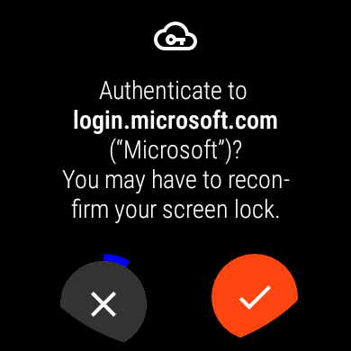

# WearAuthn (Beta)

[](https://play.google.com/store/apps/details?id=me.henneke.wearauthn.authenticator)
[](https://play.google.com/store/apps/details?id=me.henneke.wearauthn.authenticator)

Use your watch as a security key via Bluetooth and NFC and confirm sign-ins with a single tap on your watch. With support for the "resident key" feature of the FIDO2 standard, you can even log in to certain sites simply by confirming your watch's screen lock, without having to enter a username or password.

**Note: Whenever you register WearAuthn as a security key for an account you should also set up (multiple) backup 2FA options or you may not be able to access your account if you lose your watch, delete the app or run into a bug.**

- [WearAuthn (Beta)](#wearauthn-beta)
  - [Security keys](#security-keys)
  - [Usage](#usage)
    - [Bluetooth](#bluetooth)
    - [NFC](#nfc)
  - [Compatibility & Setup](#compatibility--setup)
    - [Windows (Bluetooth)](#windows-bluetooth)
    - [macOS (Bluetooth)](#macos-bluetooth)
      - [Known issues](#known-issues)
    - [Chrome OS (Bluetooth)](#chrome-os-bluetooth)
    - [Linux (Bluetooth)](#linux-bluetooth)
    - [Android (NFC)](#android-nfc)
    - [iPhones (NFC)](#iphones-nfc)
  - [Security](#security)
  - [Privacy policy](#privacy-policy)
  - [Code](#code)

## Security keys

Many websites allow you to additionally protect your accounts via certain types of *second-factor authentication* (2FA), such as numerical codes sent via SMS or generated by a mobile app. Security keys, which are sometimes also called *hardware tokens*, are generally more secure than those traditional approaches to 2FA since they employ public-key cryptography to protect against phishing and credential theft. Security keys can already be configured for accounts at [Google](https://myaccount.google.com/signinoptions/two-step-verification), [Microsoft](https://account.live.com/proofs/manage/additional), [GitHub](https://github.com/settings/security), and many other sites (see [twofactorauth.org](https://twofactorauth.org/) for a full list).

Traditionally, security keys take the form of USB sticks, but there are also models that can be used via NFC, Bluetooth or Lightning. But many computers and phones even come with security key functionality built-in: Windows Hello, macOS Touch ID (with Chrome) or your Android 7+ phone can all be used with sites asking for a security key. Unfortunately, Wear OS watches could so far not be used as security keys, even though many of them are equipped with hardware facilities for cryptographic keys used for Google Pay. This is where WearAuthn comes in.

## Usage

Watch a demo:

[](https://youtu.be/yghpblun8sM)

WearAuthn can be used as a security key for your devices either via Bluetooth or Near Field Communication (NFC). All Wear OS watches are equipped with Bluetooth, but only the ones that come with Google Pay will have support for NFC.

### Bluetooth

In order to use WearAuthn with a Bluetooth-capable device, simply pair the device once from your watch's Bluetooth settings. Afterwards, launch WearAuthn and tap on your device in the list of paired Bluetooth devices. Once WearAuthn is "attached", the device will behave as if a USB security key were attached to it.

### NFC

Just hold your watch to your NFC-capable phone when you are asked to "Use your Security Key". WearAuthn does not have to be running for this to work, it suffices that your watch's screen is on. NFC will not be active while your watch's screen is in ambient or always-on mode.

## Compatibility & Setup

Due to security restrictions imposed on third-party apps by Wear OS, WearAuthn is not able to offer its authentication capabilities via Bluetooth Low Energy (BLE). As a consequence, mobile devices such as Android and iOS devices **cannot** use WearAuthn via Bluetooth.

### Windows (Bluetooth)

No setup required and fully supported by Chrome, Edge and Firefox on Windows 10 Version 1809 and later.

If you have WearAuthn's single-factor mode enabled and are using Chrome or Edge, you can even [log in to your Microsoft account with a single tap on your watch](https://support.microsoft.com/en-us/help/4463210/windows-10-sign-in-microsoft-account-windows-hello-security-key).

### macOS (Bluetooth)

No setup required, but only supported by Chrome at the moment.

#### Known issues

* macOS will sometimes disconnect from the watch a short time after you connected to it from within WearAuthn. If this happens, just connect again and the connection should be stable.

### Chrome OS (Bluetooth)

Will not work with some devices, which is most likely because Chrome OS applies its own set of rules for low-level device access. This is currently being investigated in [crbug/1036698](https://bugs.chromium.org/p/chromium/issues/detail?id=1036698).  

### Linux (Bluetooth)

Works with Chrome, but may require manually adding a udev rule so that software on your device can access WearAuthn without running as root.

If WearAuthn is connected to your Linux device, but you still do not receive confirmation prompts when a security key operation is initiated in Chrome, follow these steps depending on your Linux distribution:

**CentOS/RHEL/Fedora/Arch Linux:** These distributions offer a package that automatically detects security keys and allows access to them for normal users. To install, just run:

```bash
sudo dnf install u2f-hidraw-policy # CentOS/RHEL/Fedora
sudo pacman -S u2f-hidraw-policy # Arch
```

**Other distributions:** Providing a simple udev rule file is unfortunately not possible since the required rule depends on your particular watch model. It is thus recommended to install `u2f-hidraw-policy` from source as follows:

```bash
sudo apt install git libudev-dev make pkg-config
# or install dependencies manually for distros without apt
git clone https://github.com/amluto/u2f-hidraw-policy
cd u2f-hidraw-policy
make
sudo make install
```

### Android (NFC)

Your Android device has to be equipped with NFC in order to use it with WearAuthn. If you are able to pay in stores with Google Pay on your device, then you will also be able to use WearAuthn.

### iPhones (NFC)

You will be able to use WearAuthn with Safari on your NFC-capable iPhones running iOS version 13.3. 

## Security

**If you identify any security problems within WearAuthn, please contact wearauthn@henneke.me.**

Since WearAuthn is just an app running on a full-fledged smartwatch OS, it is certainly not as secure as a dedicated hardware token. **If you are worried about third parties extracting or using your WebAuthn credentials, either remotely or with physical access to your watch, do not use WearAuthn and invest in a hardware security key instead, a list of which you can find [here](https://fidoalliance.org/certification/fido-certified-products).**

WearAuthn will use the Android Keystore system to store the private keys associated with your registrations, which may or may not mean that your keys are stored in secure hardware that is part of your watch. Even if they were, if someone were to exploit a vulnerability in Wear OS and remotely root your watch, they would always be able to freely use all your private keys without a chance for you to notice.

You can find out whether WearAuthn stores your keys in a dedicated hardware module by launching the "About" screen from WearAuthn's main menu and scrolling down to a line that starts with "Key storage:". If it says "Hardware", then your keys are stored in a Trusted Execution Environment (TEE) integrated in your watch, which means that Google asserts that it believes the extraction of the key material (but of course not its use) to be not possible remotely.

## Privacy policy

The WearAuthn privacy policy can be accessed [here](PRIVACY.md) or from the apps "About" screen.

## Code

WearAuthn is open source[<sup>1</sup>](#footnote) and available under the terms of the [MIT license](LICENSE). Some parts of the code were modified from the Android Open Source Project (also see the [NOTICE](NOTICE)) and are marked with their original license terms.

Pull requests and feature suggestions are very welcome!

The code is structured as follows:

- [`authenticator`](authenticator) (Wear OS app module): watch app that offers U2F/FIDO2 via Bluetooth HID and NFC; contains the following packages below `me.henneke.wearauthn`:
  - [`bthid`](authenticator/src/main/java/me/henneke/wearauthn/bthid): Bluetooth HID device emulation for API levels 28+ (thanks to @ginkage and his [WearMouse](https://github.com/ginkage/wearmouse))
  - [`complication`](authenticator/src/main/java/me/henneke/wearauthn/complication): Watch face complication that starts WearAuthn and connects to a preset device (available as an in-app purchase in the Play Store version)
  - [`fido`](authenticator/src/main/java/me/henneke/wearauthn/fido): Implementation of the U2F and FIDO2 authenticator functionality
    - [`context`](authenticator/src/main/java/me/henneke/wearauthn/fido/context): Backend for the authenticator, handles the actual storage of cryptographic keys and the UI aspects of authenticator operations
    - [`ctap2`](authenticator/src/main/java/me/henneke/wearauthn/fido/ctap2): Implementation of the CTAP2 protocol used to communicate with FIDO2 authenticators (includes a library for CBOR (de)serialization)
    - [`hid`](authenticator/src/main/java/me/henneke/wearauthn/fido/hid): Implementation of the HID transport for U2F and CTAP2; uses Kotlin coroutines for concurrency
    - [`nfc`](authenticator/src/main/java/me/henneke/wearauthn/fido/nfc): Implementation of the NFC transport for U2F and CTAP2; uses [Android host-based card emulation](https://developer.android.com/guide/topics/connectivity/nfc/hce) which is also available on Google Pay-enabled Wear OS watches
    - [`u2f`](authenticator/src/main/java/me/henneke/wearauthn/fido/u2f): Implementation of the U2F (CTAP1) protocol for backwards compatibility; nowadays mostly used via NFC
  - [`sync`](authenticator/src/main/java/me/henneke/wearauthn/sync): Synchronization with the phone app, currently only used to keep track of the complication unlock
  - [`ui`](authenticator/src/main/java/me/henneke/wearauthn/ui): Authenticator UI classes, such as the timed confirmation dialog and device list
- [`companion`](companion) (Android app module): phone app with in-app purchase for unlocking the watch face complication
- [`metadata`](metadata): FIDO Authenticator Metadata for WearAuthn, which describes its features and can be used to run conformance tests

<b id="footnote">1:</b> The open source version of WearAuthn differs from the Play Store in that it does not run on watches on API levels below 28. This is because support for Bluetooth HID device emulation is only available via reflection on these older versions of Wear OS/Android.
